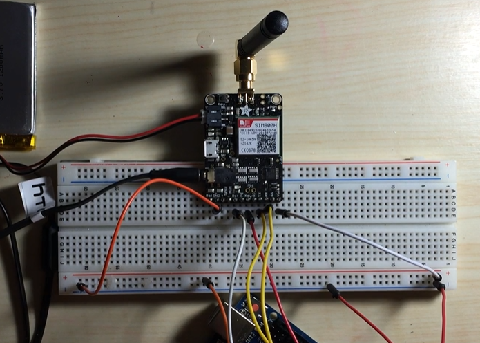

# Phone-using-Arduino

In this project I have developed a phone using an arduino UNO board and a GSM Shield incorporated with a 2G Sim Card and an antenna 
which lets users call, text and listen to FM Radio.
Along with Arduino UNO we used the Adafruit FONA 800 Breakout Board (MiniGSM) or the Adafruit FONA 800 Shield, Right angle GSM Quad band Antenna (with 2dbi gain), Li-ion Battery
3.7v and 1200mAh, earphones and a 2G sim card.

The physical circuit on the breadboard looks like-

Once the circuit is complete and the code is uploaded to the arduino uno we can start using our phone.
